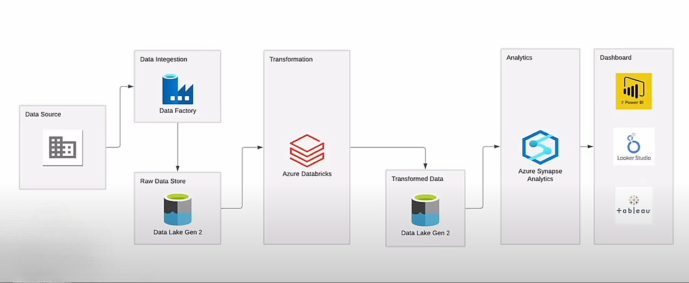
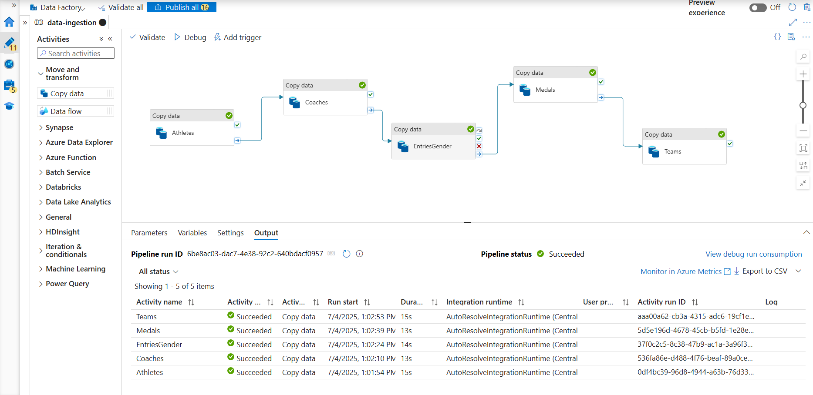
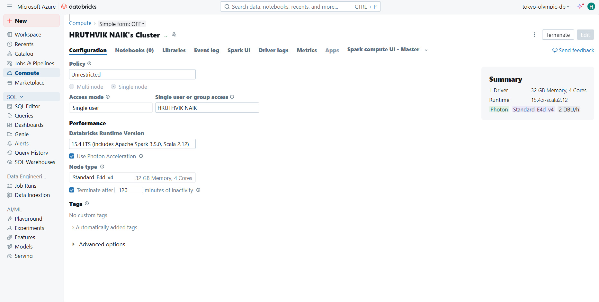
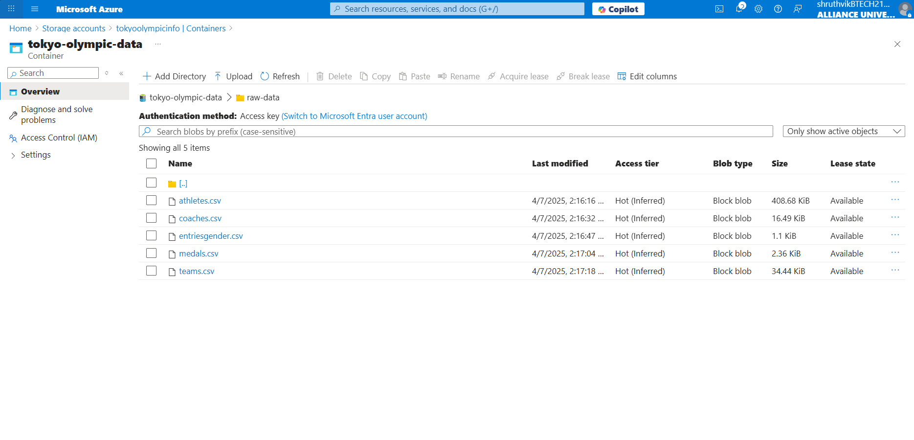

# 📊 Azure Data Engineering Project: Tokyo Olympics Data Pipeline

This project demonstrates a complete Azure Data Engineering workflow that ingests raw Olympic data (CSV) from GitHub, transforms it using PySpark in Azure Databricks, and stores both raw and transformed data in Azure Data Lake Storage Gen2.

---

## 📌 Architecture Diagram



---

## 🧰 Tools & Technologies

- Azure Data Factory
- Azure Databricks
- Azure Data Lake Storage Gen2
- Azure App Registrations (Client ID, Tenant ID, Secret)
- PySpark (Apache Spark)
- Azure Key Vault *(Recommended for production use)*
- GitHub (Data Source)

---

## 📁 Folder Structure

```
.
├── notebooks/
│   └── Tokyo_Olympics_Transformation.ipynb
├── data/
│   └── (raw CSV files)
├── outputs/
│   ├── pic1.png
│   ├── pic2.png
│   ├── pic3.png
│   └── structure.png
├── README.md
```

---

## 📸 Visual Overview

### 🔁 Azure Data Factory - Pipeline to Ingest CSV from GitHub



---

### 🔥 Azure Databricks - Data Transformation with PySpark



---

### 📂 Azure Data Lake Gen2 - Raw Data Container



---

## 📊 Datasets Used

- athletes.csv
- coaches.csv
- entries_gender.csv
- medals.csv
- teams.csv

---

## 📝 Pipeline Steps

1. **Ingest Raw Data:**
   - Azure Data Factory copies CSV files from GitHub to Data Lake (Raw folder).

2. **Mount Storage to Databricks:**
   - Registered Azure App (Client ID, Tenant ID, Secret).
   - Granted `Storage Blob Data Contributor` access via IAM.
   - Used `dbutils.fs.mount()` to mount container in Databricks.

3. **Read and Transform Data:**
   - Loaded CSVs using Spark DataFrames.
   - Applied `.withColumn()` and `.cast()` to change data types.
   - Used `.select()`, `.orderBy()`, and `.groupBy()` for filtering/aggregation.
   - Demonstrated lazy evaluation in PySpark.

4. **Write Transformed Data:**
   - Saved DataFrames into the `transformed` container in Azure Data Lake.
   - Used `.repartition()` for optimized file size.
   - Output includes partitioned `.csv` files.

---

## ✅ Output

All transformed datasets are stored in Azure Data Lake (`transformed` folder) and are ready for downstream consumption using Azure Synapse Analytics or Power BI.

---

## 🚀 What’s Next?

- Connect transformed data to Azure Synapse or Power BI.
- Build dashboards and visual reports.
- Perform advanced analytics or ML modeling.

---

## ⭐ Show Your Support

If you found this project helpful, please ⭐ star the repository and share it with your peers!

🔗 GitHub Repository: [Hruth-Vik/Tokyo-olympics-Analysis](https://github.com/Hruth-Vik/Tokyo-olympics-Analysis)
